<!--
  Ce README affiche hero.svg (animé). Les statistiques dedans sont recalculées
  toutes seules chaque jour par .github/workflows/stats.yml — ne pas éditer à la main.
  L'encart web3game plus bas, lui, est écrit à la main : libre de le modifier.
-->

  

 

### web3game — un moteur pair-à-pair pour des mondes partagés, sans serveur central

Un univers de mondes où l'on se retrouve à plusieurs, avec une identité qu'on possède vraiment.
R&D poussée, documentée sans rien arrondir : ce qui marche, ce qui résiste, et les doutes encore ouverts.
**Le code est privé ; la présentation et toute la documentation technique sont publiques et se lisent librement.**

A peer-to-peer engine for shared worlds — no central server. Documentation is public; source access on request, via the link above.

